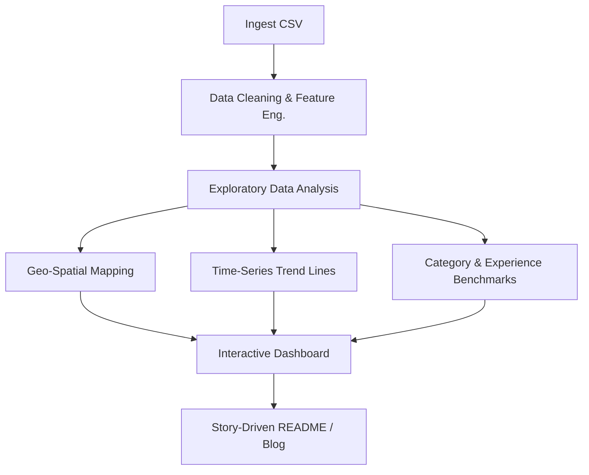

# Data‑Science Salary Trends & Market Intelligence (2020‑2023)

*An end‑to‑end data‑storytelling project that turns raw salary records into actionable market intelligence for job‑seekers, hiring managers, and compensation analysts.*

---

---

## 📌 Executive Summary

Data‑driven organisations are in a talent race for **Data Scientists, Engineers, and AI specialists**. Yet salary expectations remain opaque and differ wildly across geography, experience level, and company maturity.\
This project analyses **9 355 anonymised job‑level records (2020‑2023)** from the open‑source *AI‑Jobs* dataset to answer three high‑stakes questions:

1. *How have data‑science salaries evolved year‑over‑year?*
2. *Which specialisations and experience tiers command the biggest premium?*
3. *What macro‑factors (location, work setting, company size) drive compensation outliers?*

### Key Business Insights

| # | Insight                                                                                                                   | Business Impact                                                                            |
| - | ------------------------------------------------------------------------------------------------------------------------- | ------------------------------------------------------------------------------------------ |
| 1 | **Entry‑level pay rose 18 % since 2020**—outpacing inflation and signalling healthy demand for fresh talent.              | Budget junior roles competitively to avoid early attrition.                                |
| 2 | **Machine‑Learning & AI roles earn a \~28 % premium** over the dataset average.                                           | Prioritise ML hiring where automation & AI initiatives are strategic.                      |
| 3 | **Remote roles doubled and pay 12 % more** on median than in‑office equivalents.                                          | Use flexible work as both a talent magnet and cost‑efficiency lever.                       |
| 4 | Canada’s leadership & management salaries are **15 % higher** than U.S. equivalents, despite lower technical pay overall. | Leverage Canadian market for experienced leaders while controlling technical‑talent costs. |

*(Scroll to the *[*Findings*](#-findings)* section for full analysis.)*

---

## 1. Motivation

As graduating **M.Eng. candidates in Data Science & Analytics**, we wanted a 360° view of the market we are about to enter. Understanding pay dynamics, remote‑work trends, and skill‑based premiums enables smarter career moves *and* helps employers shape competitive offers.

---

## 2. Dataset Overview

| Field                                           | Description                                            |
| ----------------------------------------------- | ------------------------------------------------------ |
| **work\_year**                                  | Calendar year of the record (2020‑2023)                |
| **job\_title**                                  | Raw title (e.g. *Data Scientist*, *ML Engineer*)       |
| **job\_category**                               | Normalised to 10 macro categories for cleaner analysis |
| **salary\_currency / salary / salary\_in\_usd** | Local‑currency and USD‑adjusted gross annual pay       |
| **employee\_residence**                         | Country of residence                                   |
| **experience\_level**                           | Entry • Mid • Senior • Executive                       |
| **employment\_type**                            | FT • PT • Contract • Freelancer                        |
| **work\_setting**                               | Remote • Hybrid • In‑person                            |
| **company\_location / company\_size**           | HQ country & size bucket (S / M / L)                   |

> Source: [AI‑Jobs Global Salaries](https://www.kaggle.com/datasets) (public domain). 12 columns × 9 355 rows.

---

## 3. Guiding Questions

1. **Year‑on‑Year Growth** – What is the inflation‑adjusted salary trajectory for each experience tier?
2. **Category Benchmarks** – Which of the 10 job categories yield the highest compensation and why?
3. **Geo & Setting Effects** – How do location, remote ratio, and company size influence pay?
4. **Skill Demand Signals** – Which entry‑level titles dominate recent postings?

---

## 4. Methodology



*Tools:* **Python (pandas, Plotly, Folium)** · **Seaborn** · **Streamlit / Power BI** · **GitHub Actions** for automated notebook rendering.

---

## 5. Repository Structure

```text
├── data/
│   ├── raw/                    ← original Kaggle dump
│   └── processed/              ← clean & enriched CSVs
├── notebooks/
│   └── data‑science‑jobs‑trends.ipynb
├── dashboards/
│   └── salary‑trends‑dashboard.pbix
├── docs/
│   └── figures/                ← exported PNGs/JPEGs for README
├── src/                        ← reusable utility modules
├── requirements.txt
└── README.md                  ← you are here
```

---

## 🚀 Quickstart

```bash
# 1️⃣ Clone the repo
$ git clone https://github.com/your‑handle/data‑science‑salary‑trends.git && cd data‑science‑salary‑trends

# 2️⃣ Create environment
$ python -m venv venv && source venv/bin/activate && pip install -r requirements.txt

# 3️⃣ Run the notebook
$ jupyter lab notebooks/data‑science‑jobs‑trends.ipynb

# 4️⃣ (Optional) Launch Streamlit dashboard
$ streamlit run src/app.py
```

---

## 📈 Findings&#x20;

| Theme          | Insight                                                                            | Evidence                   |
| -------------- | ---------------------------------------------------------------------------------- | -------------------------- |
| **Experience** | Entry‑level median pay rose from **\$60 k → \$71 k** (2020→2023).                  | `fig_experience_trend.png` |
| **Category**   | *Machine Learning & AI* beats *BI & Viz* by **\~\$30 k** on USD median.            | `fig_category_boxplot.png` |
| **Geo**        | U.S. remains top‑paying; Swiss & Australian roles creep into Top‑5.                | Choropleth map (Folium)    |
| **Remote**     | Remote salaries > On‑site by **12 %** on median, controlling for role & seniority. | `fig_remote_vs_onsite.png` |

*A deep‑dive narrative with visuals sits inside the notebook & dashboard.*

---

## 6. Challenges & Lessons Learned

- **Data quality trade‑offs** – Country names & job titles required heavy normalisation.
- **Inflation adjustment** – Tested CPI vs. minimum‑wage benchmarks; adopted the latter for transparency.
- **Visual overload** – Iterated on chart density to keep the story recruiter‑friendly.

---


## 7. License

Project code is MIT‑licensed; dataset usage follows the original [Kaggle terms](https://www.kaggle.com).\
Visual assets are CC‑BY‑4.0 unless noted otherwise.

---

## 9. Contact

**Himanshu Dahiya**\
> *“Turning data into decisions.”*

